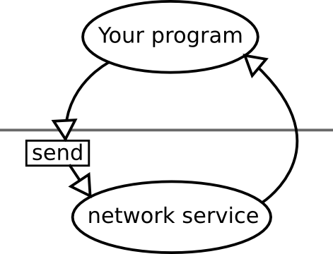

.. _tut-overview:

********
Overview
********

Rationale
=========

As libbitcoin is an asynchronous *toolkit*, there is no one way of developing
programs - it is up to the individual author. Different approaches are better
for different situations.

Core Concepts and Functionality
===============================

Basic libbitcoin Anatomy
------------------------

Before using libbitcoin it may be useful to get a conceptual picture of the
various parts of libbitcoin, your program, and how they work together.

libbitcoin is centered around various components that provide critical
infrastructure for bitcoin functionality. These components are called
*services*. Services run inside their own thread contexts and can exist in
multiple threads. Interacting with a service is done through their interface.

Services implement thread-safe interfaces as a strict rule. Tasks are submitted
to services and upon completion, your program will be notified. Services are
self contained units and are locally encapsulated. They implement an interface
for which various implementations may exist- the blockchain service has an
implementation for BerkeleyDB and LevelDB.

There are two basic service actions in libbitcoin:

* **Operation**. Perform operation. Notified upon completion.
* **Subscribe**. Subscribe to possible event. Notified upon event.

All methods on services return immediately.

Broadly speaking the main services in libbitcoin can be divided down three
lines into network, blockchain and supporting services.

Network services
^^^^^^^^^^^^^^^^

these services are concerned with the network side of things.

* :class:`channel`
* :class:`network`
* :class:`protocol`
* :class:`hosts`
* :class:`handshake`

Blockchain services
^^^^^^^^^^^^^^^^^^^

Bitcoin's blockchain is usually disk oriented. Backends all implement the
:class:`blockchain` interface allowing programs to utilise backends using the same code.

* :class:`blockchain` (abstract interface for blockchain backends)
* :class:`bdb_blockchain`
* :class:`leveldb_blockchain`

Supporting services
^^^^^^^^^^^^^^^^^^^

These services utilise other services and provide additional functionality.
They can be thought of as wrapper services composed of other services.

* :class:`poller`
* :class:`transaction_pool`
* :class:`session`

Threadpools and Services
------------------------

Theory
^^^^^^

When calling a method on a service to initiate an action, your program is
submitting a piece of work to that service’s proactor engine to complete.
Once the program is ready, it will take that piece of work from the queue,
complete it and then call the completion handler passed to it.

This program calls send on the :class:`network` service passing a data
type to be sent, and a completion handler. The send function call returns
immediately and the program continues on.

The task gets submitted to the service. Once the
service is ready and has completed its previous tasks,
it awakens and grabs the latest piece of work from the queue (send object).

The :class:`network` service sends the packet to the bitcoin network asynchronously.
Upon completion it calls the completion handler passed to it, and fetches the
next piece of work to complete. The program continues on from where it left off.

Note that this service can exist in multiple threads, and it may be
performing another piece of work while doing this send. Scalability is resolved
in this way by having services able to run with any defined number of threads
using a :class:`threadpool` object.

Practice
^^^^^^^^

Services are objects inside libbitcoin that perform asynchronous operations
like doing a long disk operation or calling other services. Their constructor
accepts a :class:`threadpool` object.

Work that is submitted to the services is added to that :class:`threadpool`,
and will be queued in that context.

::

    // Define 2 threadpools with 6 threads in total.
    // disk_pool has 4 threads, and net_pool has 2.
    // Operations submitted to net_pool will only run in those 2 threads
    // spawned by net_pool.
    threadpool disk_pool(4), net_pool(2);
    // This blockchain service will submit work to disk_pool
    blockchain chain(disk_pool);
    // Completion handler.
    auto blockchain_started = 
        {
            // Check whether the status was successful.
            if (ec)
                log_error() << "Starting blockchain: " << ec.message();
            // ... do stuff
        };
    // Invoke the call. Returns immediately.
    chain.start("database/", blockchain_started);

Dependency Injection
^^^^^^^^^^^^^^^^^^^^

Data Types
----------

These core types are used around the library in multiple places where
working with hashes or raw data chunks.

.. cpp:type:: data_chunk

   Raw bytes. A chunk of data. This type is equivalent to
   ``std::vector<uint8_t>``.

.. cpp:type:: hash_digest

   32 byte result of a SHA256 hash. Same type as ``std::array<uint8_t, 32>``.

.. cpp:type:: short_hash

   20 byte result of a RIPEMD hash. Typically used for decoded
   Bitcoin addresses (RIPEMD hash of public key). Same as
   ``std::array<uint8_t, 20>``.

Additionally helper functions exist for working with these types.

.. cpp:function:: void extend_data<D, T>(D& chunk, const T& other)

   Insert *other* at the end of *chunk*.

.. cpp:function:: T cast_chunk<T>(data_chunk chunk, bool reverse=false)
.. cpp:function:: data_chunk uncast_type<T>(T value, bool reverse=false)

   Convert chunk to and from different integer types. i.e
   ``cast_chunk<uint32_t>(chunk)`` converts *chunk* into a 4 byte
   integer. Assumes ``chunk.size() >= 4`` bytes.

.. cpp:function:: std::string pretty_hex<T>(T data)

   Encode *data* into a hex string.
   ::

    hash_digest block_hash = hash_block_header(genesis_block());
    // Displays 000000000019d6689c085ae165831e934ff763ae46a2a6c172b3f1b60a8ce26f
    std::cout << pretty_hex(block_hash) << std::endl;

.. cpp:function:: data_chunk bytes_from_pretty(std::string byte_stream)

   Decode hex string into raw data.

.. cpp:function:: HashType hash_from_pretty<HashType>(std::string byte_stream)

   Decode hex string into a hash type (either :type:`hash_digest` or
   :type:`short_hash`).

Logging
-------

.. log levels. log domains. setting output function.

std::error_code
---------------

libbitcoin generally does not use exceptions, instead relying on
:class:`std::error_code` objects. Objects of this type hold an error code value.
::

    #include <bitcoin/bitcoin.hpp>
    #include <iostream>
    
    int main()
    {
        // error_code without a value.
        std::error_code ec;
        if (!ec)
            std::cout << "std::error_code is not set." << std::endl;
        // Now set a value.
        ec = bc::error::operation_failed;
        if (ec)
            std::cout << "std::error_code value: " << ec.message() << std::endl;
        return 0;
    }

Output::

    std::error_code is not set.
    std::error_code value: Operation failed

std::bind
---------

:func:`std::bind` is for `partial function application <http://en.wikipedia.org/wiki/Partial_application>`_.

Suppose you have a function object f which takes 3 arguments::

    f(a, b, c)

You want a new function object which only takes two arguments, defined as::

    g(a, b) = f(a, 4, b)

``g`` is a "partial application" of the function ``f``: the middle argument has already
been specified, and there are two left to go.

You can use ``std::bind`` to get ``g``::

    auto g = std::bind(f, _1, 4, _2);

This enables libbitcoin methods that expect one function type to be mapped
to different methods that expect different or additional arguments.
:func:`std::bind` allows data to be bound to a function only for the duration of
that function object.
::

    #include <functional>
    #include <iostream>
    
    using std::placeholders::_1;
    
    int add(int x, int y)
    {
        return x + y;
    }
    
    int main()
    {
        // add is a function that takes two integers and returns their sum.
        // add5 is defined as a functor of one argument, denoted _1, that calls
        // add on its argument with the constant 5 as the first argument.
        auto add5 = std::bind(add, 5, _1);
        std::cout << add5(2) << std::endl;
        return 0;
    }

To bind class methods, pass the class pointer in as the second argument::

    std::bind(&my_class::foo, this, _1, _2, "somedata", _3);

If you want to keep the object alive until the end of the function object,
then pass an :class:`std::shared_ptr` instead. You can use :func:`shared_from_this`
to return an object's :class:`std::shared_ptr` if needed. See
`here <http://en.cppreference.com/w/cpp/memory/enable_shared_from_this>`_ for
info on :class:`std::enable_shared_from_this`.

The equivalent using C++ lambdas of above would be::

    auto add5 = 
        {
            return add(5, y);
        };

    // If using shared_from_this() then use the line below and
    // pass in this_ptr instead of this.
    //   auto this_ptr = shared_from_this();
    // And use this_ptr->foo(...) instead.
    auto bar = [this](int x, data_chunk d, int y)
        {
            return foo(x, d, "somedata", y);
        };

std::promise and std::future
----------------------------

The class :class:`std::promise` provides a facility to store a value that is
later acquired asynchronously via a :class:`std::future` object, that the
:class:`std::promise` can supply. 

:class:`std::promise` and :class:`std::future` enable you to turn asynchronous methods
into synchronous ones. libbitcoin makes extensive use of completion handlers
to signal the result of a method invocation. Combining these classes enables
you to block in the same thread of control until the result is returned.
::

    std::promise<std::error_code> ec_promise;
    // Completion handler called when blockchain is started.
    auto blockchain_started_handler =
        [&ec_promise](const std::error_code& ec)
        {
            ec_promise.set_value(ec);
        };
    chain.start("database", blockchain_started_handler);
    // Block until ec_promise value is set in the handler.
    std::error_code ec = ec_promise.get_future().get();
    if (ec)
        std::cerr << "Error starting blockchain: " << ec.message() << std::endl;

A promise is a vehicle for passing the return value from the thread executing
a function to the thread that cashes in on the function future. 

A future is the synchronization object constructed around the receiving end of
the promise channel.

So, if you want to use a future, you end up with a promise that you use to get
the result of the asynchronous processing. 

